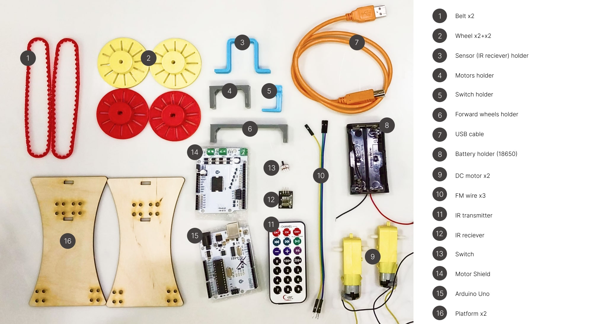
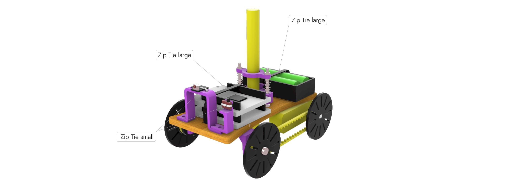

#   Bot

>**1.Необходимое детали**



>**2.Сборка робота**


>**3.Готовый робот**




**С помощью этого кода робот сможет рисовать квадрат**
```C++
#include <IRremote.hpp>

#define IR_RECEIVE_PIN 0
#define IR_BUTTON_PLUS 21
#define IR_BUTTON_MINUS 7
#define IR_BUTTON_CH_PLUS 71
#define IR_BUTTON_CH_MINUS 69
#define IR_BUTTON_PLAY_PAUSE 67

#define SPEED_1      5 
#define DIR_1        4
 
#define SPEED_2      6
#define DIR_2        7

void setup(){
  Serial.begin(9600);
  IrReceiver.begin(IR_RECEIVE_PIN);

  for (int i = 4; i < 8; i++) {     
    pinMode(i, OUTPUT);
  }
}

void loop(){
   if (IrReceiver.decode()) {
      IrReceiver.resume(); // Enable receiving of the next value
      int command = IrReceiver.decodedIRData.command;
      
      switch (command) {
        case IR_BUTTON_PLUS: {

          digitalWrite(DIR_1, LOW); // set direction
          analogWrite(SPEED_1, 255); // set speed

          digitalWrite(DIR_2, LOW); // set direction
          analogWrite(SPEED_2, 255); // set speed

          break;
        }
        case IR_BUTTON_MINUS: {
          digitalWrite(DIR_1, HIGH); // set direction
          analogWrite(SPEED_1, 255); // set speed

          digitalWrite(DIR_2, HIGH); // set direction
          analogWrite(SPEED_2, 255); // set speed

          break;
        }
        case IR_BUTTON_CH_PLUS: { // stop mototrs
          digitalWrite(DIR_1, HIGH); // set direction
          analogWrite(SPEED_1, 255); // set speed

          digitalWrite(DIR_2, LOW); // set direction
          analogWrite(SPEED_2, 255); // set speed

          break;
        }
        case IR_BUTTON_CH_MINUS: { 

          digitalWrite(DIR_1, LOW); // set direction
          analogWrite(SPEED_1, 255); // set speed

          digitalWrite(DIR_2, HIGH); // set direction
          analogWrite(SPEED_2, 255); // set speed
                                                         
          delay (600);
          
          digitalWrite(DIR_1, LOW); // set direction
          analogWrite(SPEED_1, 255); // set speed

          digitalWrite(DIR_2, LOW); // set direction
          analogWrite(SPEED_2, 255); // set speed

          delay (800);

          digitalWrite(DIR_1, LOW); // set direction
          analogWrite(SPEED_1, 255); // set speed

          digitalWrite(DIR_2, HIGH); // set direction
          analogWrite(SPEED_2, 255); // set speed

          delay (600);

          digitalWrite(DIR_1, LOW); // set direction
          analogWrite(SPEED_1, 255); // set speed

          digitalWrite(DIR_2, LOW); // set direction
          analogWrite(SPEED_2, 255); // set speed

          delay (800);

          digitalWrite(DIR_1, LOW); // set direction
          analogWrite(SPEED_1, 255); // set speed

          digitalWrite(DIR_2, HIGH); // set direction
          analogWrite(SPEED_2, 255); // set speed

          delay (600);

          digitalWrite(DIR_1, LOW); // set direction
          analogWrite(SPEED_1, 255); // set speed

          digitalWrite(DIR_2, LOW); // set direction
          analogWrite(SPEED_2, 255); // set speed

          delay (800);

          digitalWrite(DIR_1, LOW); // set direction
          analogWrite(SPEED_1, 255); // set speed

          digitalWrite(DIR_2, HIGH); // set direction
          analogWrite(SPEED_2, 255); // set speed

          delay (600);


          analogWrite(SPEED_1, 0); 
          analogWrite(SPEED_2, 0);

          break;
        }
          case IR_BUTTON_PLAY_PAUSE: {
            
          analogWrite(SPEED_1, 0); 
          analogWrite(SPEED_2, 0);

          break;
        }
      }
  }
}
```


*Результат*

https://github.com/madinakhakimova/Bot/assets/144451345/6f00f54c-cb35-4060-a7fe-8ba1fee0199f


